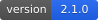
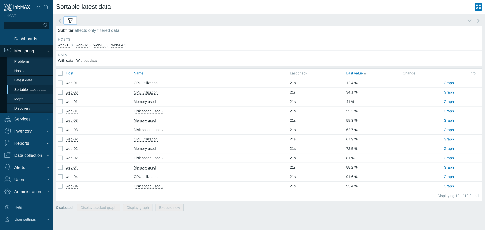
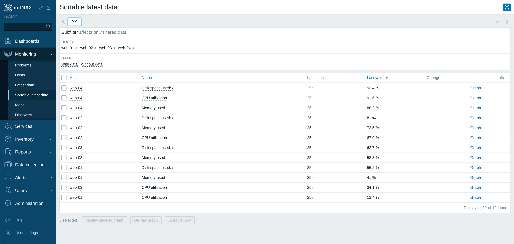
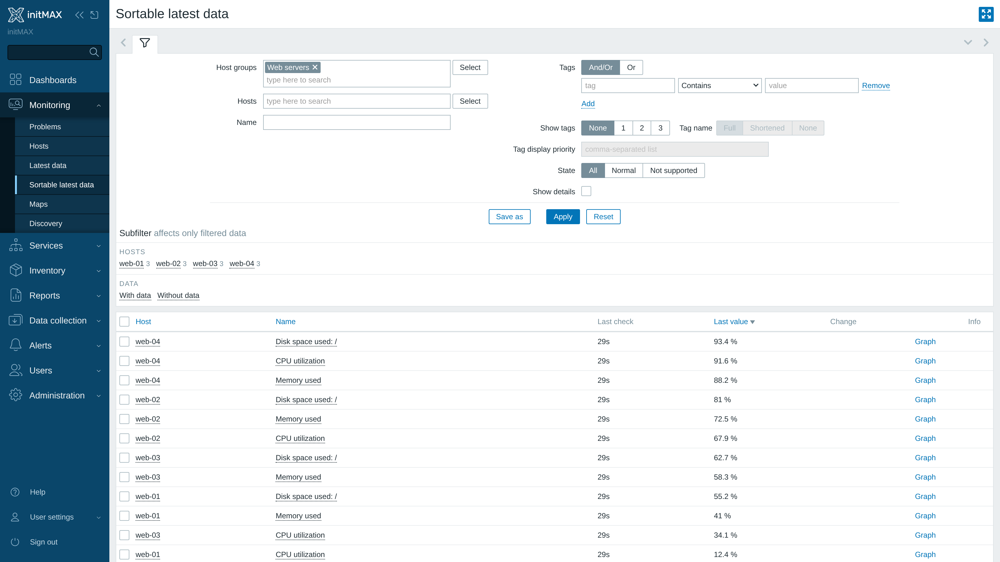
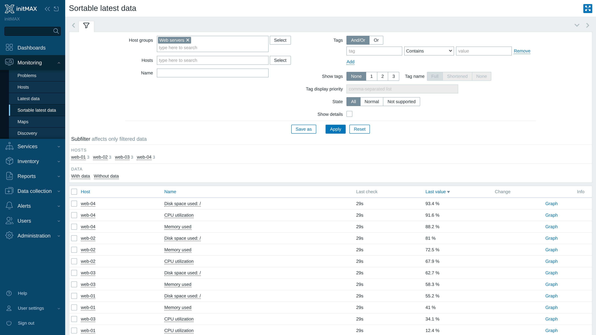
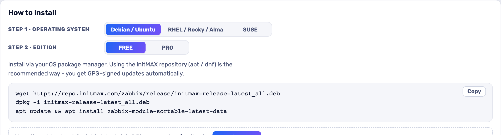

<h1>Sortable latest data</h1>

developed and maintained by

and community

<strong>Sort Latest data by the VALUE, not just by host and name.</strong> 
Zabbix's own page, with your filters and your subfilters, plus the one column it has never let you order by.

<a href="#what-you-can-build"><strong>Features</strong></a> &nbsp;·&nbsp;
<a href="#examples"><strong>Examples</strong></a> &nbsp;·&nbsp;
<a href="#install"><strong>Install</strong></a> &nbsp;·&nbsp;
<a href="#free-vs-pro"><strong>FREE vs PRO</strong></a> &nbsp;·&nbsp;
<a href="https://portal.initmax.com"><strong>Portal</strong></a> &nbsp;·&nbsp;
<a href="https://www.initmax.com/wiki/sortable-latest-data/"><strong>Docs</strong></a>

 

---

## Why Sortable latest data

Zabbix's **Latest data** lets you order by **Host** and by **Name**. It has never let you order by **Last value**, **Last check** or **Change** - those live in history, not in the item table - so finding the fullest disk, the busiest interface or the item that just stopped updating means reading the whole page.

**Sortable latest data** adds a second Latest data page under *Monitoring* where **Last check**, **Last value** and **Change** are sortable columns too. Click one and the table reorders, ascending then descending, exactly like every other list in Zabbix.

Everything else is Zabbix's own page: the same filter, the same subfilters, the same context menus, the same graphs - and the **same saved filter tabs**: a filter you saved on Latest data is there on this page, and the other way round. The module does not replace or patch anything - your existing **Latest data** stays exactly as it is, and this page sits next to it.

## What you can build

<table>
<tr>
<td width="50%" valign="top">

**Latest data sorted by value**

A second Latest data page where Last value, Last check and Change are real sortable columns - top consumers, stale items and the biggest jumps in one click.

</td>
<td width="50%" valign="top">

**Ascending and descending**

Behaves like every other Zabbix list; click the header again to flip the order.

</td>
</tr>
<tr>
<td width="50%" valign="top">

**Same filter, same tools**

Saved filter tabs, subfilters and context menus all work as on the stock page.

</td>
<td width="50%" valign="top">

**Original page untouched**

The stock Latest data page stays where it is - use whichever you need.

</td>
</tr>
</table>

## Examples

<table>
<tr>
<td width="50%" align="center" valign="top"> <small><b>Sorted by Last value</b> - the largest or smallest readings come first.</small></td>
<td width="50%" align="center" valign="top"> <small><b>Sorted by Change</b> - the biggest jumps and drops since the previous value first.</small></td>
</tr>
<tr>
<td width="50%" align="center" valign="top"> <small><b>Sorted by Last check</b> - items that stopped updating come first.</small></td>
<td width="50%" align="center" valign="top"> <small><b>Shared filter</b> - Zabbix's own filter, subfilters and saved filter tabs, shared with Latest data.</small></td>
</tr>
</table>

## Configuration

There is nothing to configure - install it, enable it, done.

## Install

**FREE** ships as **GPG-signed `deb` / `rpm` packages** from the initMAX repository - `apt` / `dnf` installs them and keeps them updated.

### Easiest way - the guided installer on the Portal

Open the product page, pick your **OS** and **edition**, and copy the ready-made command. FREE is fully public (no login); PRO fills in your token once you sign in. There's a feedback box right there too.

<a href="https://portal.initmax.com/catalog/zabbix-sortable-latest-data#how-to-install"><strong>→ Open the installer on the Portal</strong></a>

Prefer a plain archive? Every release also ships as a **ZIP** [straight from the repo](https://repo.initmax.com/zabbix/free/zip/sortable-latest-data/) - handy for offline or manual installs.

The module is enabled automatically during the package installation - verify it in **Administration → General → Modules**. Done.

## FREE vs PRO

There is no paid edition - everything below is in the one package.

| Feature | FREE |
| ---------------------------------------------------------- | :----: |
| Second Latest data page with Last value, Last check and Change as sortable columns | ✅ |
| Ascending and descending, like every other Zabbix list | ✅ |
| Same filter, subfilters and context menus; saved filter tabs shared with Latest data | ✅ |
| Your original Latest data page stays untouched | ✅ |
| Localised into all 25 Zabbix display languages | ✅ |
| High availability ready | ✅ |
| Licence | AGPLv3 |

## Requirements

|              |                                                              |
| ------------ | ------------------------------------------------------------ |
| **Zabbix**   | 6.0 · 6.2 · 6.4 · 7.0 · 7.2 · 7.4 - one package covers all    |
| **PHP**      | 7.4 or newer                                                 |
| **OS**       | Debian/Ubuntu · RHEL/Rocky/Alma/Oracle/Amazon · SUSE         |
| **Editions** | FREE (public repo) - there is no paid edition                  |
| **Languages** | All 25 Zabbix display languages - the module follows each user's own language setting |
| **High availability** | Ready. No server-side component and no local state; install it on every frontend node of an HA cluster and any node can serve it |

One package covers the whole range. Zabbix changed its module API at 6.4, and the package carries what each frontend needs, so the same install works on 6.0 and on 7.4.

### What the page does the same everywhere, and what it does not

The module does not draw the table - Zabbix does, on the release you have installed. So the page always looks and behaves exactly like *your* Latest data, and the differences below are Zabbix's own, not the module's:

- **6.0** has no **State** filter and no **Execute now** button, because that Latest data page does not.
- **6.0 - 6.4** show no *binary value* rows and no raw-data hint, for the same reason.

The one honest limit of the sorting itself: **Last value**, **Last check** and **Change** order the page you are looking at. Host and Name are columns of the item table and Zabbix orders them in the database before paging; last values are read from history for the rows on the current page only, so with more than one page of results the value order is per page. Narrow the filter, or raise **Rows per page** in your user profile, to sort a larger set at once.

## Support &amp; links

- **[Documentation / Wiki](https://www.initmax.com/wiki/sortable-latest-data/)**
- **[Product page](https://www.initmax.com/product/sortable-latest-data/)**
- **[Portal](https://portal.initmax.com)** - downloads, tokens, support tickets
- **Source code (FREE, AGPLv3)** - included in every package and published as a [source archive](https://repo.initmax.com/zabbix/free/zip/sortable-latest-data/) on repo.initmax.com
- **[support@initmax.com](mailto:support@initmax.com)**

---

FREE: <a href="https://www.gnu.org/licenses/agpl-3.0.html">AGPLv3</a> &nbsp;·&nbsp; © 2021–2026 initMAX s.r.o.

